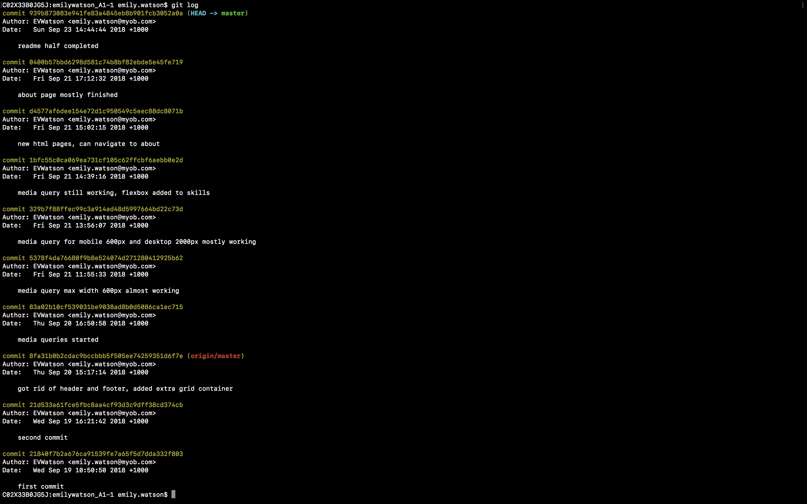

# Portfolio Project - Emily Watson

Link to website:

Visit my [GitHub](https://github.com/EVWatson/Portfolio-A1--3-)

## Description

### *Purpose* 

To provide an over-view of me as a coder and as a person, showing my skills and personality to current or prospective employers.

### *Functionality / Features*

The website is built primarily using grid. The user can navigate from one page to the next by clicking on that page's section. 

### *Sitemap*

- Home page
- About page
- Skills page
- Contact page

## Screenshots

## *Target Audience*

Current and prospective employers and peers.

## *Tech Stack* 

- HTML 5
- CSS 3

## Design Documentation

### *Design Process*

I started with a mood board on pintrest of colour palettes and web designs that i liked. I then looked for common themes in the things I had pinned, and used that as a basis to start my figma design.

I used figma to experiment with the colours I had chosen. Once i was happy with the basic design, I created the design for mobile and desktop versions.

I then wrote the code to create the website. The website followed the design for the most part, although I did have to compromise on some functions, and of course the design evolved over time.

I would have liked the website to be animated, so that when one section was the selected, it would expand, and the others would be 'pushed' out of the way. I discovered this was not possible with HTML and CSS alone, and I would have needed JavaScript to make this happen. I have not yet learnt JavaScript, so at this stage,the animation is not an option. Instead, each page can be navigated to, and the layout still looks the way I imagined for the animation.

Wireframes

## Personal Logo

I created a vector picture as my logo. Although not yet featured on my website, I would like to incorporate it later on. In the meantime, please meet Hector the Vector Cat:

## Usability Considerations

The website has been created to fit onto both desktop and mobile sized screens of an average size. Future iterations of the website would cater for a wider variety of screen sizes.

The website is fairly simple in design, with efforts made to use appropriate labelling and alternative descriptions for images. This should also cater for screen-readers.

## Planning Process 

### *Project Plan and Timeline*

Day One: mood boarding
Day Two: figma design and wireframes
Day Three: tweak figma desing, begin coding
Day Four: continue coding
Day Five: continue coding
Day Six: finalize docs, finish coding, submit assignment

Trello boards:

GitHub use:

Git Commits log:

# Short Answer Q&A 

1. Describe key events in the development of the internet from the 1980s to today (max. 150 words)

In 1980, Usenet was developed. The internet was now being used as a public source of news and bulletin style posts.

In 1983, ARPANET moved to TCP/IP, which is still used as the language of the internet to this day. The following year, the Domain Name System (DNS) was introduced, so that names rather than numbers could be assigned to the host.

TCP/IP (Transmission Control Protocol / Internet Protocol) was developed by Vinton Cerf. His idea allowed for all the worlds computers to communicate with one-another, creating a world wide network.

The first web page and web browser was launched in 1991 by Tim Berners-Lee. He created the version of the internet - the World Wide Web - that we know today. This is the version that creates a web of information that is accessible by anyone, as well as allowing for files to be sent from one place to another. The first internet search tool Gopher was also launched in 1991. 

Later on in 1994, the web browser Netscape Navigator version 1.0 is released. Netscape then introduced Secure Socets Layer (SSL) in 1995; this made using credit cards online much safer.

In 1995, eBay, Amazon.com and JavaScript all come into existance, followed by Hotmail in 1996. Two years later, the Google search engine is launched.

Since then, many other notable companies have launched, including iTunes and Wikipedia in 2001,Facebook and Firefox in 2004, and YouTube in 2005.

2. Define and describe the relationship between fundamental aspects of the internet such as: domains, web servers, DNS, and web browsers (max. 150 words)

Domains and DNS: a domain is the address of the website. The address is a sting of numbers. DNS stands for Domain Name System. The domain name is for ease of use; facebook.com is much easier for a human to remember than a series of numbers. The IP address is still needed, however,so that computers can identify each other over the network. 

A web server is both a computer that stores the webserver software and the website component files, and the webserver software itself that controls how web users access hosted files. There are two types of web servers, static and dynamic. Static is a computer with an HTTP server. Hosted files are sent 'as is' to your computer. Dynamic is a static webserver that also has an application server and a database. Hosted files are updated by the application server before they are sent to your computer.

Web browsers: 

1. Reflect on one aspect of the development of internet technologies and how it has contributed to the world today (max. 150 words)

Short answer question sources:

- [Techopedia](https://www.techopedia.com/2/27889/internet/a-timeline-of-the-development-of-the-internet-and-world-wide-web)

- [History.com](https://www.history.com/topics/inventions/invention-of-the-internet)

- [How Stuff Works](https://computer.howstuffworks.com/dns.htm)

- [MDN Web Docs](https://developer.mozilla.org/en-US/docs/Learn/Common_questions/What_is_a_web_server)