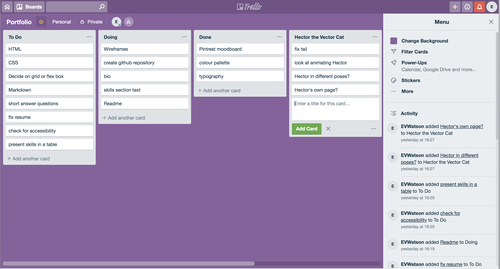
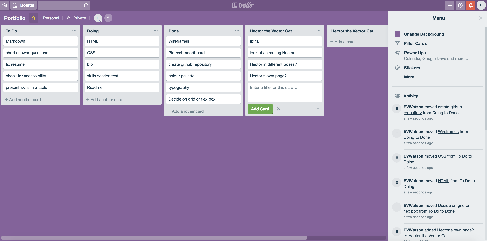
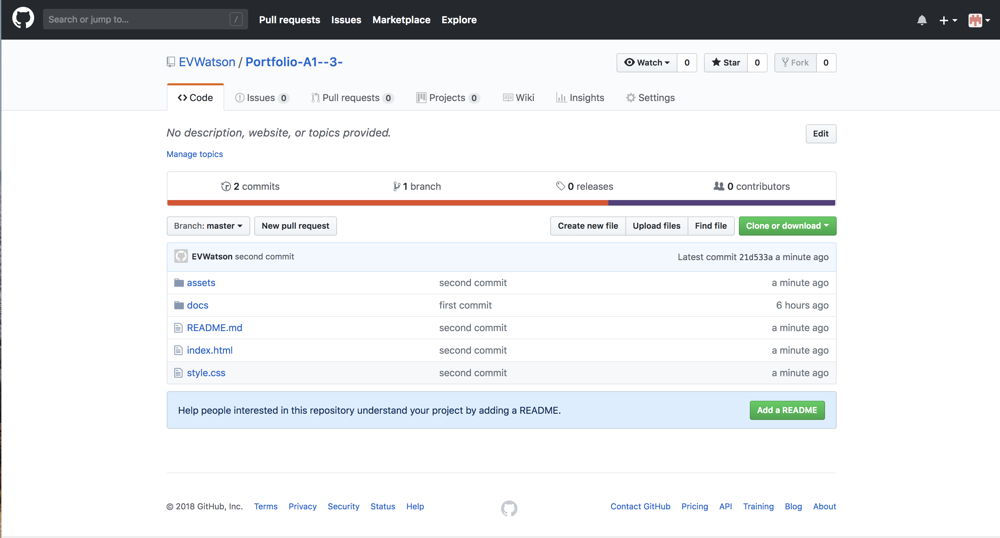

# Portfolio Project - Emily Watson

Link to website:

Visit my [GitHub](https://github.com/EVWatson/Portfolio-A1--3-)

## Description

### *Purpose* 

To provide an over-view of me as a coder and as a person, showing my skills and personality to current or prospective employers.

### *Functionality / Features*

The website is built primarily using grid. The user can navigate from one page to the next by clicking on that page's section. 

### *Sitemap*

- Home page
- About page
- Skills page
- Contact page

## Screenshots

Trello:

GitHub:

## *Target Audience*

Current and prospective employers and peers.

## *Tech Stack* 

- HTML 5
- CSS 3

## Design Documentation

### *Design Process*

I started with a mood board on pintrest of colour palettes and web designs that i liked. I then looked for common themes in the things I had pinned, and used that as a basis to start my figma design.

Wireframes
Personal logo (optional)
Usability considerations
Details of planning process including,
Project plan & timeline
Screenshots of Trello board(s)
Short Answer Q&A - Include short answers to the following questions,
Describe key events in the development of the internet from the 1980s to today (max. 150 words)
Define and describes the relationship between fundamental aspects of the internet such as: domains, web servers, DNS, and web browsers (max. 150 words)
Reflect on one aspect of the development of internet technologies and how it has contributed to the world today (max. 150 words)